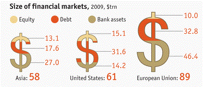

Let's see if we can fix the graph from <i>The Economist</i>, adding some color and fiddling with the details a bit.

Here's another look at it.


<p>From <i>The Economist</i>, 14 May 2011, "Special Report on International Banking"

First, let's put the data into a matrix.

```{r}
Asia=c(27.0,17.6,13.1)
US=c(14.2,31.6,15.1)
EU=c(46.4,32.8,10.0)

markets=cbind(Asia,US,EU)
```

Now, we'll try a different <b>barplot()</b>. We just turn the whole thing on its side and add colors&mdash;viz. <i>skyblue</i>,<i>salmon</i>, and <i>sienna</i>.

```{r}
par(las=1,mar=c(5,5,5,8),xpd=NA)
bp <- barplot(markets,horiz=T,width=c(.5,.5,.5),space=.5,beside=F,
    col=c('skyblue','salmon','sienna'),names.arg=c('Asia','U.S.','E.U.'),axes=F)
```

Now, we'll add values to the segments within each bar + a title 

```{r}
par(las=1,mar=c(5,5,5,8),xpd=NA)
bp <- barplot(markets,horiz=T,width=c(.5,.5,.5),space=.5,beside=F,
    col=c('skyblue','salmon','sienna'),names.arg=c('Asia','U.S.','E.U.'),axes=F)
cexval=0.9
text(Asia[1]/2,bp[1],paste(Asia[1]),adj=c(0.5,.5),cex=cexval)
text(Asia[1]+(Asia[2]/2),bp[1],paste(Asia[2]),adj=c(0.5,.5),cex=cexval)
text(Asia[1]+Asia[2]+(Asia[3]/2),bp[1],paste(Asia[3]),adj=c(0.5,.5),cex=cexval)
text(US[1]/2,bp[2],paste(US[1]),adj=c(0.5,.5),cex=cexval)
text(US[1]+(US[2]/2),bp[2],paste(US[2]),adj=c(0.5,.5),cex=cexval)
text(US[1]+US[2]+(US[3]/2),bp[2],paste(US[3]),adj=c(0.5,.5),cex=cexval)
text(EU[1]/2,bp[3],paste(EU[1]),adj=c(0.5,.5),cex=cexval)
text(EU[1]+(EU[2]/2),bp[3],paste(EU[2]),adj=c(0.5,.5),cex=cexval)
text(EU[1]+EU[2]+(EU[3]/2),bp[3],paste(EU[3]),adj=c(0.5,.5),cex=cexval)
text(45,2.5,'Size of Financial Markets, 2009',cex=1.4)

```

We can add a legend for the colors. We can also add the totals as separate "legends" at the right.

```{r}
par(las=1,mar=c(5,5,5,8),xpd=NA)
bp <- barplot(markets,horiz=T,width=c(.5,.5,.5),space=.5,beside=F,
    col=c('skyblue','salmon','sienna'),names.arg=c('Asia','U.S.','E.U.'),axes=F)
cexval=0.9
text(Asia[1]/2,bp[1],paste(Asia[1]),adj=c(0.5,.5),cex=cexval)
text(Asia[1]+(Asia[2]/2),bp[1],paste(Asia[2]),adj=c(0.5,.5),cex=cexval)
text(Asia[1]+Asia[2]+(Asia[3]/2),bp[1],paste(Asia[3]),adj=c(0.5,.5),cex=cexval)
text(US[1]/2,bp[2],paste(US[1]),adj=c(0.5,.5),cex=cexval)
text(US[1]+(US[2]/2),bp[2],paste(US[2]),adj=c(0.5,.5),cex=cexval)
text(US[1]+US[2]+(US[3]/2),bp[2],paste(US[3]),adj=c(0.5,.5),cex=cexval)
text(EU[1]/2,bp[3],paste(EU[1]),adj=c(0.5,.5),cex=cexval)
text(EU[1]+(EU[2]/2),bp[3],paste(EU[2]),adj=c(0.5,.5),cex=cexval)
text(EU[1]+EU[2]+(EU[3]/2),bp[3],paste(EU[3]),adj=c(0.5,.5),cex=cexval)
text(45,2.5,'Size of Financial Markets, 2009',cex=1.4)
# Size in $trillion label
text(104,2.5,'Size in $trillion')
# point to the legends
arrows(102,2.4,102,2.2,length=.2)
legend(95,bp[3]+.15,'89.2     ')
legend(95,bp[2]+.15,'60.9     ')
legend(95,bp[1]+.15,'57.7     ')
legend(15,.15,fill=c('skyblue'),c('Bank Assets'),bty='n')
legend(40,.15,fill=c('salmon'),c('Debt'),bty='n')
legend(58,.15,fill=c('sienna'),c('Equity'),bty='n')
```
