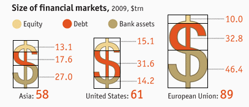

Let's see if we can fix the graph from <i>The Economist</i>, adding some color and fiddling with the details a bit.


<p>From <i>The Economist</i>, 14 May 2011, "Special Report on International Banking"

This graphic, used to illustrate the size of financial markets in the Special Report on International Banking (14 May 2011), was misleading. The intention, clearly, was to illustrate the proportion of each market which was assignable to Equity, Debt, and Bank Assets by the vertical extent of the colored regions. The height was intended to be proportional to the size of the markets (58, 61, and 89 trillion dollars, for Asia, the U.S. and the E.U., respectively).
 
There are a couple of problems. The hue and contrast choice is poor, especially for persons with certain types of colorblindness; I am one of these. Another problem is that the area of the rectangle which circumscribes the $ goes up out of proportion to the value of the size of the market. This gives a distorted impression of the relative size of the E.U. financial markets compared to both the Asia and U.S. markets. I've drawn in rectangles, below, to show what I mean.



Note in the table how the ratio of E.U. to U.S. as the area of the rectangle (by my estimate) goes up by a ratio of 2.17 when the actual ratio of market sizes is 1.46. This inflates the ratio by about one and a half times (2.17/1.46 = 1.49). The effect is much smaller for the ratio of U.S. to Asia markets 


<table border="1" width="400" height="100">
<tr>
<th></th>
<th align="center" valign="middle">Asia</th>
<th align="center" valign="middle">U.S.</th>
<th align="center" valign="middle">E.U.</th>
<th align="center" valign="middle">U.S./Asia<br>Ratio</th>
<th align="center" valign="middle">E.U./U.S.<br>Ratio</th>
</tr>
<tr>
<th>Area</th>
<td align="center" valign="middle">1.13</td>
<td align="center" valign="middle">1.30</td>
<td align="center" valign="middle">2.81</td>
<td align="center" valign="middle">1.15</td>
<td align="center" valign="middle">2.17</td>
</tr>
<tr>
<th>Size</th>
<td align="center" valign="middle">58</td>
<td align="center" valign="middle">61</td>
<td align="center" valign="middle">89</td>
<td align="center" valign="middle">1.05</td>
<td align="center" valign="middle">1.46</td>
</tr>
</table>

<p>First, let's put the data into a matrix.

```{r}
Asia=c(27.0,17.6,13.1)
US=c(14.2,31.6,15.1)
EU=c(46.4,32.8,10.0)

markets=cbind(Asia,US,EU)
```
Now, we'll try a different <b>barplot()</b>. We just turn the whole thing on its side and add colors&mdash;viz. <i>skyblue</i>,<i>salmon</i>, and <i>sienna</i>.

```{r pass1}
par(las=1,mar=c(5,5,5,8),xpd=NA)
bp <- barplot(markets,horiz=T,width=c(.5,.5,.5),space=.5,beside=F,
    col=c('skyblue','salmon','sienna'),names.arg=c('Asia','U.S.','E.U.'),axes=F)
```
Now, we'll add values to the segments within each bar + a title 

```{r pass2}
<<pass1>>
cexval=0.9
text(Asia[1]/2,bp[1],paste(Asia[1]),adj=c(0.5,.5),cex=cexval)
text(Asia[1]+(Asia[2]/2),bp[1],paste(Asia[2]),adj=c(0.5,.5),cex=cexval)
text(Asia[1]+Asia[2]+(Asia[3]/2),bp[1],paste(Asia[3]),adj=c(0.5,.5),cex=cexval)
text(US[1]/2,bp[2],paste(US[1]),adj=c(0.5,.5),cex=cexval)
text(US[1]+(US[2]/2),bp[2],paste(US[2]),adj=c(0.5,.5),cex=cexval)
text(US[1]+US[2]+(US[3]/2),bp[2],paste(US[3]),adj=c(0.5,.5),cex=cexval)
text(EU[1]/2,bp[3],paste(EU[1]),adj=c(0.5,.5),cex=cexval)
text(EU[1]+(EU[2]/2),bp[3],paste(EU[2]),adj=c(0.5,.5),cex=cexval)
text(EU[1]+EU[2]+(EU[3]/2),bp[3],paste(EU[3]),adj=c(0.5,.5),cex=cexval)
text(45,2.5,'Size of Financial Markets, 2009',cex=1.4)

```
We can add a legend for the colors. We can also add the totals as separate "legends" at the right.

```{r pass3}
<<pass2>>
# Size in $trillion label
text(104,2.5,'Size in $trillion')
# point to the legends
arrows(102,2.4,102,2.2,length=.2)
legend(95,bp[3]+.15,'89.2     ')
legend(95,bp[2]+.15,'60.9     ')
legend(95,bp[1]+.15,'57.7     ')
legend(15,.15,fill=c('skyblue'),c('Bank Assets'),bty='n')
legend(40,.15,fill=c('salmon'),c('Debt'),bty='n')
legend(58,.15,fill=c('sienna'),c('Equity'),bty='n')
```
