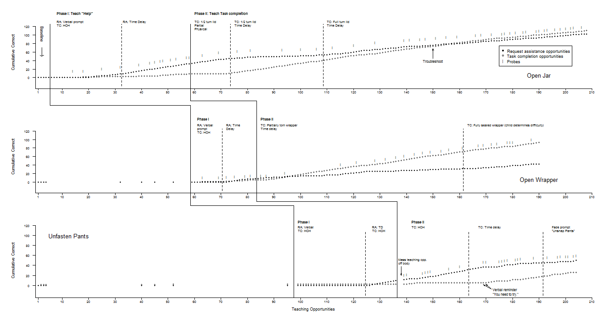

This is a three-part plot that was developed for a journal article in 2007<sup>*</sup>. Each segment is plotted from a separate R file. In order to coordinate the lines that zig-zag down the page from segment to segment, it was necessary to output this to a separate window, adjust the window, and tweak the dimensions, accordingly, so all the lines would come together.

All of the labels were specific and non-general, as you can see. There was a great deal of tweaking of the par() parameters as well (see, below). The entire effort required what might be termed brute force.

<b>xpd</b> = NA # needed for clipping to the entire device region<br>
<b>oma</b> = c(rep(0.2,4))  # needed to minimize the lines for abscissa and top axis<br>
<b>mfcol</b> = c(3,1) # obvious<br>
<b>mar</b> = c(3,6,4,2.75)  # wide for y <br>


<sup>*</sup>Reichle, J., Dropik, P. L., Alden-Anderson, E., & Haley, T. (2008). Teaching a Young Child With autism to request assistance conditionally: A preliminary study, <i>American Journal of Speech-Language Pathology</i>, <i>17</i>, 231-240.


Here's the code for part 1 (JER_Fig1a.r). The code for the second and third files is similar.

```{r echo=F}
library(knitr)
read_chunk('JER_Fig1a.r')
```

```{r Fig1All,echo=T,eval=F}

```