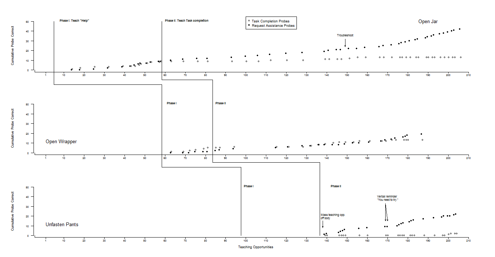

This is a second three-part plot that was developed for the same journal article in 2007<sup>*</sup>. Once again, each segment is plotted from a separate R file.


<sup>*</sup>Reichle, J., Dropik, P. L., Alden-Anderson, E., & Haley, T. (2008). Teaching a Young Child With autism to request assistance conditionally: A preliminary study, <i>American Journal of Speech-Language Pathology</i>, <i>17</i>, 231-240.


Here's the code for part 1 (JER_Fig2a.r). The code for the second and third files is similar.

```{r echo=F}
library(knitr)
read_chunk('JER_Fig2a.r')
```

```{r Fig2All,echo=T,eval=F}

```