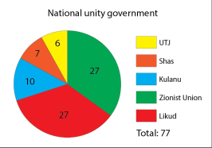
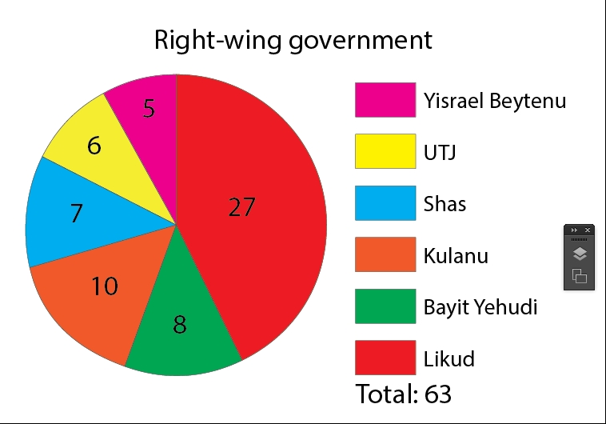
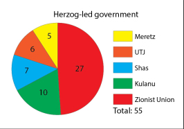
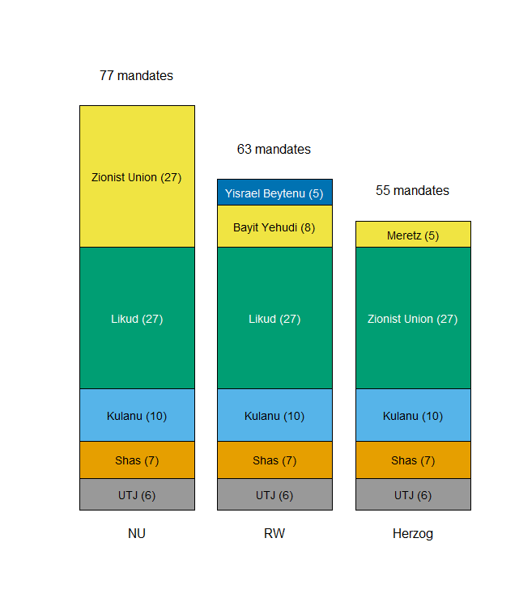
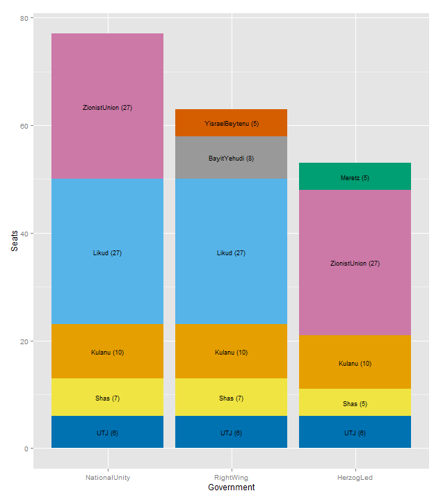

Three pie charts were used to describe the combinations of parties that would be needed to form a government, with a particular make-up-National Unity, Right-Wing, and Herzog-led.

<br>





<br>

Naomi Robbins of Forbes, has a <a href="http://www.forbes.com/sites/naomirobbins/2015/03/19/color-problems-with-figures-from-the-jerusalem-post" target="_blank">critique</a> which focuses on the color inconsistency (Likud is red in only 2 of the 3 graphs, for example), color blindness unfriendliness, as well as the very idea of pie charts.

I decided to try to build a stacked barplot (in R) which uses the common elements in the three governments to make the graphs more consistent and shows how the building of the coalitions might take place.



The idea is to start with the three parties that the governments would have in common, United Torah Judaism (UTJ), Shas, and Kulanu. Next, comes a block of 27 seats from Likud (2) and Zionist Union (1). The topmost show how the governments' mandates would be fleshed out. The proportions are much easier to see than in pie charts, and the contribution of the largest parties is most evident.

I didn't have time to treat the color discrepancy, because of the way that R's barplot() function works. I do think that the way the blocks stack and the use labels in the blocks (instead of in a key to one side) mitigates this problem. I did address the color blindness problem by using a color-blind-friendly palette.

Here's the code.

```{r, eval=F }
# set up data for each government type
NU <- c(6,7,10,27,27,NA)
# use cumsum() to help position text labels
NUcum <- cumsum(NU)
RW <- c(6,7,10,27,8,5)
RWcum <- cumsum(RW)
Herzog <- c(6,7,10,27,5,NA)
Herzogcum <- cumsum(Herzog)
Parties <- c('UTJ (6)','Shas (7)','Kulanu (10)','Zionist Union (27)','Likud (27)','Bayit Yehudi (8)','Meretz (5)','Yisrael Beytenu (5)')

# put data into a matrix
dat <- cbind(NU,RW,Herzog)
cbPalette <- c("#999999", "#E69F00", "#56B4E9", "#009E73", "#F0E442", "#0072B2", "#D55E00", "#CC79A7")
bp <- barplot(dat,ylab='',las=1,ylim=c(0,85),axes=F,col=cbPalette,xpd=NA)
# parameterize text size and adj for text()
cex.val <- 0.9
adj.val <- c(0.5,0.5)
# labels will appear in the middle of each stacked box
text(bp[1],NU[1]/2,paste(Parties[1]),adj=c(0.5,.5),col='black',cex=cex.val)
# use cumsum() values to scaffold the next value
text(bp[1],NUcum[1]+NU[2]/2,Parties[2],adj=adj.val,col='black',cex=cex.val)
text(bp[1],NUcum[2]+NU[3]/2,Parties[3],adj=adj.val,col='black',cex=cex.val)
text(bp[1],NUcum[3]+NU[4]/2,Parties[5],adj=adj.val,col='white',cex=cex.val)
text(bp[1],NUcum[4]+NU[5]/2,Parties[4],adj=adj.val,col='black',cex=cex.val)
text(bp[2],RW[1]/2,Parties[1],adj=adj.val,col='black',cex=cex.val)
text(bp[2],RWcum[1]+RW[2]/2,Parties[2],adj=adj.val,col='black',cex=cex.val)
text(bp[2],RWcum[2]+RW[3]/2,Parties[3],adj=adj.val,col='black',cex=cex.val)
text(bp[2],RWcum[3]+RW[4]/2,Parties[5],adj=adj.val,col='white',cex=cex.val)
text(bp[2],RWcum[4]+RW[5]/2,Parties[6],adj=adj.val,col='black',cex=cex.val)
text(bp[2],RWcum[5]+RW[6]/2,Parties[8],adj=adj.val,col='white',cex=cex.val)
text(bp[3],Herzog[1]/2,Parties[1],adj=adj.val,col='black',cex=cex.val)
text(bp[3],Herzogcum[1]+Herzog[2]/2,Parties[2],adj=adj.val,col='black',cex=cex.val)
text(bp[3],Herzogcum[2]+Herzog[3]/2,Parties[3],adj=adj.val,col='black',cex=cex.val)
text(bp[3],Herzogcum[3]+Herzog[4]/2,Parties[4],adj=adj.val,col='white',cex=cex.val)
text(bp[3],Herzogcum[4]+Herzog[5]/2,Parties[7],adj=adj.val,col='black',cex=cex.val)
# add text labels to the top of each stack
text(bp[1],83,'77 mandates')
text(bp[2],69,'63 mandates')
text(bp[3],61,'55 mandates')
```

<a href="http://www.math.unm.edu/people/academic-personnel/erik-erhardt" target="_blank">Erik Erhardt</a>, a professor in the Department of Mathematics & Statistics at the University of New Mexico, Albuquerque, took my idea and reworked it in ggplot2. His production comes out much shorter and has the advantage of matching the colors to the parties. Slick use of ddply (from plyr package) too.



Here's Erik's code:

```{r eval=F}
## R code starts here
dat <- read.table(text="
                  Party NationalUnity RightWing HerzogLed
                  UTJ 6 6 6
                  Shas 7 7 5
                  Kulanu 10 10 10
                  Likud 27 27 NA
                  ZionistUnion 27 NA 27
                  BayitYehudi NA 8 NA
                  Meretz NA NA 5
                  YisraelBeytenu NA 5 NA
                  ", header=TRUE)

library(reshape2)
dat.long <- melt(dat, id.vars = "Party", variable.name = "Government", value.name = "Seats")

# cumsum ignoring NAs
f.cum.na <- function(x) {
  x[which(is.na(x))] <- 0
  return(cumsum(x))
}

library(plyr)
# calculate midpoints of bars
dat.long.plot <- ddply(dat.long, .(Government), transform, pos = f.cum.na(Seats) - (0.5 * Seats))

dat.long.plot$SeatsLabel <- paste(dat.long.plot$Party, " (", dat.long.plot$Seats, ")", sep="")

# The colorblind palette with grey
cbPalette <- c("#999999", "#E69F00", "#56B4E9", "#009E73", "#F0E442", "#0072B2", "#D55E00", "#CC79A7")

# plot bars and add text
library(ggplot2)
p <- ggplot(dat.long.plot, aes(x = Government, y = Seats))
p <- p + geom_bar(aes(fill = Party), stat="identity")
p <- p + geom_text(aes(label = SeatsLabel, y = pos), size = 3)
p <- p + scale_fill_manual(values=cbPalette)
p <- p + theme(legend.position="none")
print(p)
## R code ends here

```